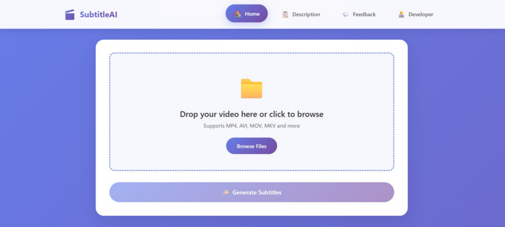
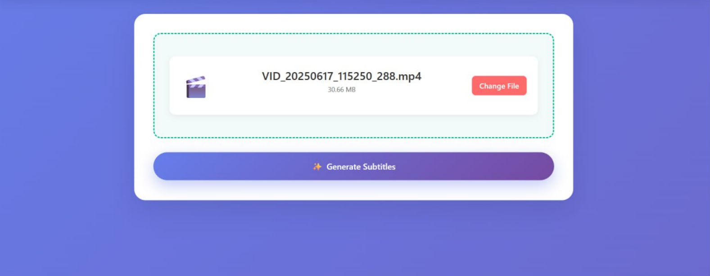

# 🎬 SubtitleAI – AI-Powered Video Subtitle Generator

Transform your videos with perfectly synced, AI-generated subtitles in minutes!

---

## 🚀 Live Demo

- **Frontend**: [https://austinabu8.github.io/subtitle-generator/](https://austinabu8.github.io/subtitle-generator/)
- **Backend Health**: [https://subtitle-ai-backend.onrender.com/health](https://subtitle-ai-backend.onrender.com/health)

---

## ✨ Features

- 🎥 **Super Easy**: Just upload a video and your subtitled version is ready to preview or download
- 📁 **Multiple Formats Supported**: MP4, MOV, AVI, MKV, and more
- 📱 **Modern Responsive UI**: Looks stunning on mobile and desktop, with smooth feedback and glassmorphism design
- 🔁 **Real-Time Progress & Error Alerts**: Stay informed about each processing step
- ⭐ **Feedback System**: Rate your experience (with stars) and leave suggestions
- ⬇️ **Quick Download**: Save the processed video with burned-in subtitles

---

## 🛠 Tech Stack

- **Frontend**: React (Vite), modern CSS
- **Backend**: Node.js, Express, Multer, Axios
- **AI Processing**: [AssemblyAI Speech-to-Text API](https://www.assemblyai.com/)
- **Video Processing**: FFmpeg (with fluent-ffmpeg)
- **Deployment**: GitHub Pages (frontend), Render.com (backend)

---

## ⚡️ How It Works

1. **Upload**: Select or drag & drop your video file.
2. **Transcribe**: The backend extracts audio and sends it to AssemblyAI for AI-powered transcription.
3. **Subtitle Burn**: FFmpeg overlays the generated subtitles onto your video.
4. **Download/Preview**: Instantly preview and download your subtitled video!

---

## 📸 Screenshots

> Project images showcasing UI:

### 🟢 Upload Video


### 🟡 Generate Subtitles

---

## 📝 API Endpoints

| URL                     | Method | Description                          |
|-------------------------|--------|--------------------------------------|
| `/upload`              | POST   | Video upload and subtitle processing |
| `/download/:filename`  | GET    | Download the processed video         |
| `/video/:filename`     | GET    | Stream/preview processed video       |
| `/test-video`          | POST   | Quick video validation               |
| `/health`              | GET    | Backend health check                 |

---

## 💻 Local Development

### 🔧 Backend Setup

```bash
git clone https://github.com/austinabu8/subtitle_ai_backend.git
cd subtitle_ai_backend
npm install
```

- Create a `.env` file with your AssemblyAI key:

```
API_KEY=YOUR_ASSEMBLYAI_KEY_HERE
```

- Start the backend:

```bash
node server.js
```

- Verify: [http://localhost:5000/health](http://localhost:5000/health)

### 🎨 Frontend Setup

```bash
git clone https://github.com/austinabu8/subtitle-generator.git
cd subtitle-generator
npm install
npm run dev
```

- Runs at: [http://localhost:5173](http://localhost:5173)
- Note: In `Home.jsx`, set the correct backend URL when deploying.

---

## 🌍 Deployment Guide

- **Frontend**: Use GitHub Pages

```bash
npm run build
npm run deploy
```

- **Backend**: Deploy on [Render.com](https://render.com/)
  - Set `API_KEY` in the Environment tab
  - Build Command: `npm install`
  - Start Command: `node server.js`

---

## ⚙️ Customization Tips

- Customize `server.js` for subtitle styles (size, color, position, etc.)
- All styling is mobile-first and easy to modify

---

## 🙋‍♂️ Developer

Created & maintained by **[Your Name]**

- GitHub: [@austinabu8](https://github.com/austinabu8)
- LinkedIn: [Your LinkedIn](https://linkedin.com/in/yourprofile)
- Email: youremail@example.com

---

## 🤝 Contributions

Pull requests and issues are welcome! Feel free to suggest features or report bugs.

---

## 📝 License

MIT License © [Your Name]

---

> Make your videos accessible and engaging with SubtitleAI!
